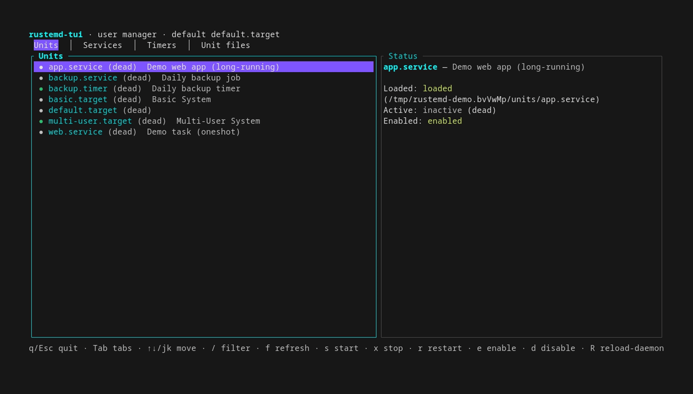

# rustemd

A **systemd init reimplementation in Rust** — a drop-in `systemctl`
replacement with a built-in unit manager: unit files, user services, timers,
and dependency-driven lifecycle. Per-service **cgroups** (Linux cgroup v2) with
**process groups** + a **subreaper** as the fallback where cgroups aren't
available.

> **Status:** functional core, Linux-focused. Unit parsing, service
> supervision, timers, socket activation, a D-Bus manager interface
> (opt-in `dbus` feature),
> udev `.device` units, `.mount` units, `enable`/`disable`, a JSON IPC
> daemon, and a `systemctl`-compatible CLI all work and are tested. No
> journald or service sandboxing yet.

---

## Quick start

```sh
cargo build --release

# Run the manager (user mode — no root needed):
./target/release/rustemd daemon --user

# In another terminal, control it with the systemctl-compatible CLI:
./target/release/rustemctl --user list-units
./target/release/rustemctl --user start myapp.service
./target/release/rustemctl --user status myapp.service
```

Two binaries split the work: `rustemd` is the PID-1 manager daemon, and
`rustemctl` is the `systemctl`-compatible CLI that talks to it. To make
existing `systemctl` scripts work unchanged, symlink the CLI under that name:

```sh
ln -s /path/to/rustemd /usr/local/bin/rustemd
ln -s /path/to/rustemctl /usr/local/bin/systemctl
```

`rustemctl` (optionally invoked via the symlink) is a drop-in `systemctl`.

### Shell completions

Generate completion scripts for your shell. Completions follow the invoked
binary name, so `rustemctl completions …` and (via the symlink)
`systemctl completions …` both work:

```sh
rustemctl completions bash        > ~/.bash_completion.d/rustemctl
rustemctl completions fish        > ~/.config/fish/completions/rustemctl.fish
rustemctl completions zsh         > ~/.zsh/completions/_rustemctl
rustemctl completions powershell   # pipe into Register-ArgumentCompleter
rustemctl completions nushell
```

## Homebrew

On Linux (e.g. Bazzite) or macOS, install from a tap without layering via
`rpm-ostree`:

```sh
brew tap fralalonde/rustemd https://github.com/fralalonde/rustemd
brew install rustemd
```

The formula (`Formula/rustemd.rb`) installs `rustemd`, `rustemctl`, and
`rustemd-tui` plus shell completions. It deliberately does **not** create a
`systemctl` symlink — on a systemd host that would shadow the real `systemctl`
in your PATH. To exercise the drop-in CLI, symlink it into a directory you
keep ahead of `/usr/bin` only while testing:

```sh
ln -s "$(brew --prefix)/bin/rustemctl" ~/.local/bin/systemctl
```

Refresh the formula's pinned sha256 after each release with
`scripts/gen-brew-formula.sh <version>` (run once the release assets are
published).

## TUI

`rustemd-tui` is a terminal client that talks to a running manager over the
same `Control` API. It **detects** the daemon's socket (it never spawns a
second instance — at most one rustemd manager runs) and shows live tabs:
**Units**, **Services**, **Timers**, and **Unit files**, each with a status
pane and single-key actions.



```sh
./target/release/rustemd-tui --user   # or: cargo run --release -p rustemd-tui -- --user
```

Keys: `Tab` switch tab · `↑`/`↓`/`j`/`k` move · `/` filter · `s` start · `x`
stop · `r` restart · `e` enable · `d` disable · `R` daemon-reload · `f`
refresh · `q`/`Esc`/`Ctrl+Q` quit.

Regenerate the GIF with `sh demo/generate.sh` (needs `vhs` + `ttyd`).

---

## What's implemented

**Unit files** (`systemd.syntax`-style)
- `[Unit]` / `[Service]` / `[Socket]` / `[Mount]` / `[Timer]` / `[Install]` sections
- `Description`, `After`, `Requires`, `Wants`, `Conflicts`
- `ExecStart` (multiple, with `-`/`@`/`+` prefixes), `ExecStartPre`,
  `ExecStartPost`, `ExecStop`, `ExecReload`, `ExecStart=-…`
- `Type=` — `simple`, `exec`, `forking`, `oneshot`, `notify`, `idle`
- `Restart=` (`no`/`on-success`/`on-failure`/`always`), `RestartSec`
- `User=`, `Group=`, `WorkingDirectory=`, `Environment=`, `EnvironmentFile=`
- `LimitNOFILE`/`LimitNPROC`/`LimitCORE`/`LimitAS` (rlimits), `Nice=`, `UMask=`
- `StandardOutput=`/`StandardError=` (`journal`, `inherit`, `null`, `file:…`)
- `RemainAfterExit=`, `PIDFile=` (forking), `KillSignal=`, `TimeoutStartSec=`,
  `TimeoutStopSec=`
- Quoting, `\` escapes, line continuations, drop-ins (`name.service.d/*.conf`),
  and specifiers (`%n`, `%p`, `%i`, `%u`, `%h`, …)

**Timers**
- `OnCalendar=` (full systemd calendar grammar: `*-*-* 09:00:00`,
  `Mon..Fri 09:00`, `*:0/15`, `daily`, `weekly`, ranges, steps, lists)
- `OnBootSec=`, `OnUnitActiveSec=`, `OnUnitInactiveSec=`, `OnStartupSec=`
- `Persistent=`, `AccuracySec=`

**Socket activation, mounts, & devices**
- `.socket` units — `ListenStream=`/`ListenDatagram=`, inetd-style activation
  via `LISTEN_FDS`, `Service=` target (the `socket` feature, default-on)
- `.mount` units — `[Mount]` `What=`/`Where=`/`Type=`/`Options=`, mount on
  start / unmount on stop (Linux only)
- `.device` units — runtime-generated from sysfs + netlink uevents (the
  `udev` feature, default-on); no unit file, matching systemd
- D-Bus — `org.fralalonde.rustemd1.Manager` (`ListUnits`/`GetUnit`/`StartUnit`/
  `StopUnit`/`Version`) plus `Type=dbus`/`BusName=` activation (Linux only;
  behind the opt-in `dbus` feature, not in `default`; not a `systemd1` drop-in)

**Lifecycle & supervision**
- Dependency graph (start order from `After`/`Requires`, stop order reversed)
- Process groups as the supervision boundary; `kill(-pgid, …)` reaches the
  whole tree, SIGTERM then SIGKILL
- Subreaper for daemonizing (`forking`) services
- `systemctl start/stop/restart/reload/kill/status/is-active/is-failed`
- `enable` / `disable` / `is-enabled` via `[Install]` symlinks
  (`WantedBy=`, `RequiredBy=`, `Alias=`, `Also=`)

**Control surfaces**
1. `systemctl`-compatible CLI
2. JSON-over-unix-socket IPC (the `rustemd daemon` listens here)
3. A **programmatic `Control` API** (library alternative to the CLI/D-Bus) —
   see below

---

## Programmatic control API

The library exposes a `Control` trait implemented two ways — an **in-process**
[`Manager`] and a **remote** [`SocketClient`] — so callers can hold a
`&mut dyn Control` without caring which one they have. This is the intended
alternative to shelling out to `systemctl` or speaking D-Bus.

```rust
use rustemd::control::{Control, SocketClient};

fn main() -> Result<(), Box<dyn std::error::Error>> {
    // Talk to a running daemon over the socket (like `systemctl` does).
    let mut ctl = SocketClient::for_mode(false /* system */)?;

    ctl.start(&["myapp.service"])?;
    for status in ctl.status(&["myapp.service"])? {
        println!("{}: {} ({})", status.name, status.active, status.sub);
    }
    ctl.stop(&["myapp.service"])?;
    Ok(())
}
```

An in-process manager implements the same trait:

```rust
use rustemd::control::Control;
use rustemd::manager::{Manager, ManagerCfg};

let mut mgr = Manager::new(ManagerCfg::for_mode(false)?)?;
mgr.load_all();
mgr.start(&["myapp.service"])?;      // Control::start
```

Typed request/response structs — [`UnitStatus`], [`UnitSummary`],
[`TimerInfo`], [`UnitFileInfo`] — are `Serialize`/`Deserialize` and are the
same types the wire protocol carries.

---

## Architecture

This is a Cargo **workspace** with three crates: `rustemd` (the library and
the PID-1 `rustemd` daemon), `rustemctl` (the `systemctl`-compatible control
CLI, which depends on the library), and `rustemd-tui` (the terminal client,
which depends on the library's `Control` API).

| Module | Responsibility |
| --- | --- |
| `unit` | Unit-file parser + typed unit configuration |
| `calendar` / `timespan` | systemd calendar expressions & time spans |
| `manager` | The daemon: unit table, state machine, process supervision, timers, socket activation, mounts, udev devices |
| `manager::ops` | Typed operations shared by IPC and the `Control` API |
| `manager::deps` | Dependency graph (start/stop ordering) |
| `manager::timer` | Cancelable timer wheel |
| `platform` | OS-specific surface: `process` (spawn/kill/reap), `signals` (signalfd), `net` (unix sockets), `mount` (mount/umount), `udev` (sysfs/netlink devices) |
| `dbus` | zbus bridge for the `org.fralalonde.rustemd1.Manager` interface (Linux, opt-in `dbus` feature) |
| `ipc` / `client` | JSON wire protocol + client |
| `control` | The `Control` trait + in-process/remote implementations |
| `daemon` | The PID-1 manager entry point (`rustemd daemon`) |
| `enable` | `[Install]` symlink management |
| `paths` | System vs. user filesystem layout |

The `systemctl`-compatible CLI lives in the separate `rustemctl` crate (its
`cli` module), which consumes the library's `client`/`paths`/`enable`/
`cli_style`/`names` modules.

**Portability.** All raw Linux/unix syscalls live in `platform/` behind small,
documented functions. Porting to a new OS means reimplementing those three
submodules, not auditing the manager. `unsafe` is confined to two justified
sites: the `pre_exec` closure in `platform::process` (the API requires it) and
a one-line `prctl(PR_SET_CHILD_SUBREAPER)`.

---

## Testing

```sh
cargo test            # 72 unit tests + 10 e2e daemon tests + 1 rustemctl CLI test
cargo clippy -- -D warnings
cargo fmt --check
```

Integration tests boot the real manager and drive it over the socket —
`rustemd/tests/e2e.rs` uses the programmatic `Control` API, and
`rustemctl/tests/cli.rs` runs the compiled `rustemctl` binary against the
daemon — both against a scratch filesystem via the `RUSTEMD_*` env hooks.

---

## Limitations (intentional, for now)

- **cgroup v2 (Linux)** — one cgroup per unit for reliable tree cleanup and
  `MemoryMax`/`MemoryHigh`/`CPUWeight`/`TasksMax`; falls back to process groups
  + a subreaper where cgroups aren't available.
- **PID-1 boot is opt-in** — the `boot` cargo feature adds mounting
  `/proc`/`/sys`/`/dev`/`/run`/`cgroup2`, early-boot config (hostname, sysctl,
  modules, fstab), template units (`getty@tty1`), and `reboot(2)` power-off.
  Off by default — a container runtime does this for you. Test it with
  `scripts/ns-boot-test.sh` (unprivileged namespaces, no qemu),
  `scripts/vm-test.sh` (qemu + initramfs, automated), or drive it
  interactively with `scripts/live-vm.sh` (see [DEMO.md](DEMO.md)).
- **D-Bus is opt-in** — the `dbus` cargo feature pulls in zbus for
  `Type=dbus`/`BusName=` activation and the `org.fralalonde.rustemd1.Manager`
  control interface. Off by default to keep the default build free of the
  zbus/zvariant/async-executor dependency tree (and ~48% smaller). Build with
  `--features dbus` to enable it.
- **Linux/unix only** — `platform/` is `#[cfg(unix)]`; Windows/Mac are planned.
- No journald, service sandboxing (`ProtectSystem=`, `DynamicUser=`, seccomp,
  capability/device restrictions), or `systemd-analyze`-style tooling. See
  [`KNOWN_ISSUES.md`](KNOWN_ISSUES.md) for the full categorized list.
- `notify` types are supported (`NOTIFY_SOCKET`), but `sd_notify`'s watchdog is
  not yet wired.

See [`docs/handbook.md`](docs/handbook.md) for worked examples.

## License

MIT
